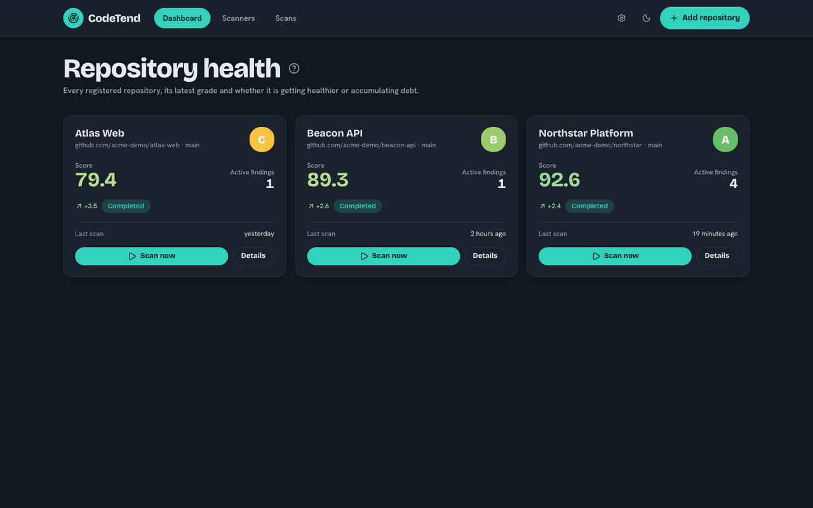
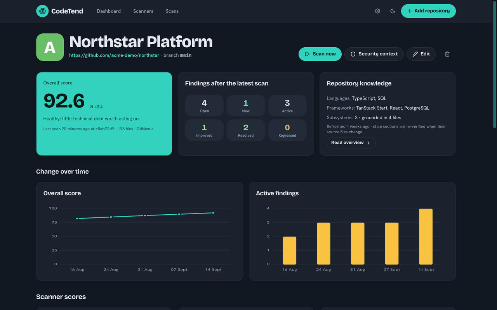

<!-- markdownlint-disable MD033 -->
<h1 align="center">
  <br>
  CodeTend
</h1>

<p align="center">
  <strong>Continuous, language-agnostic health scans of whole repositories by
  specialized LLM agents.</strong><br>
  Deterministic scores, tracked findings, and copy-pasteable fix prompts for
  your coding agent. Self-hosted.
</p>

<p align="center">
  <a href="#-quick-start">Quick start</a>
  &nbsp;·&nbsp;
  <a href="#-how-it-works">How it works</a>
  &nbsp;·&nbsp;
  <a href="#-documentation">Documentation</a>
</p>

<p align="center">
<a href="https://github.com/michidk/CodeTend/actions/workflows/ci.yml">
</a>


</p>

<p align="center">
  
</p>

---

> [!WARNING]
> **Proof of concept.** CodeTend works end to end and is used on real
> repositories, but its authentication boundary is single-tenant and the
> full LLM scan is an external-service integration. Read
> [Limitations](#-limitations) before relying on it.

## 🔍 What it is

CodeTend is **not** an autonomous pull-request bot. It registers repositories
and, on a schedule or on demand, makes a fresh checkout of the configured
branch and runs fourteen specialized scanner agents
over it: one per dimension of technical debt, from architecture and
duplication to reliability, type safety, AI slop, dependency health and
security. Their structured findings become deterministic scores and grades,
every finding is tracked across scans, and each dimension produces one
aggregated fix prompt you paste into Claude Code, Codex or another coding
agent.

- 🧭 **Fourteen dimensions, one registry.** Architecture & Modularity,
  Duplication & Abstraction, Dead & Obsolete Code, Complexity &
  Maintainability, Tests & Testability, Reliability & Error Handling,
  Documentation, Domain & API Design, Type Safety & Data Contracts,
  Consistency / Vibe Debt, AI Slop & Noise, Dependencies & Build Health,
  Vulnerable Dependencies and Security Hygiene. Each scanner's prompt says
  what it owns and what its neighbours own, so nothing is reported twice.
- 📐 **Numbers the model never touches.** Every scanner starts at 100 and
  loses a fixed penalty per open finding scaled by confidence. Grades A–F
  follow fixed thresholds. The LLM proposes findings, never scores.
- 🔁 **Findings with a lifecycle.** A finding is a stable fingerprint, not a
  line number. On every rescan the scanner must re-verify each open finding,
  and the app derives `new → active → improved → resolved → regressed` from
  its own persisted results, coverage-aware and never from Git history.
- 🛡️ **Real vulnerability data.** Google's OSV Scanner matches exact lockfile
  versions; CodeTend computes CVSS locally, joins FIRST EPSS and the CISA KEV
  catalog, and keeps raw severity separate from contextual priority.
- 🧪 **Evidence, not vibes.** Security findings carry source/control/sink
  evidence, an attack path, and optional executable validation that runs
  only in a networkless, capability-dropped container, never on the host.
- 🩹 **Review-gated patches.** Generate a unified diff for one finding in a
  disposable clone, re-run its reproducer, then approve or reject. CodeTend
  never pushes a branch or opens a pull request.
- 📊 **Cost you can see.** Provider-reported tokens per scanner, per scan and
  per repository, with list-price estimates, a UTC-day budget cap, and
  concurrency limits.
- 🔒 **Yours, end to end.** PostgreSQL you run, any OpenAI-compatible model
  endpoint you choose, your own login gate in front, no telemetry.
- 🤖 **Ask your coding agent.** An optional OAuth-protected MCP endpoint lets
  Codex and other clients inspect repositories, scans, findings, and knowledge;
  a separate owner-approved scope can start or cancel scans.

## 🔄 How it works

```text
schedule / "Scan now"
        │
        ▼
 app creates a scan row and hands it to the Eve agent runtime
        │
        ▼
 Eve run_scan workflow (durable, resumable)
        │   fresh shallow clone → optional GitNexus index → OSV dependency audit
        │   → repository knowledge (refreshed only when grounding files changed)
        │   → subsystem dependency graph → budgeted file sample
        │   → parallel scanner subagents (structured output) → isolated validation
        ▼
 app enriches, prioritizes, reconciles, scores, persists and seals SARIF/Markdown artifacts
```

The app and the [Eve](https://eve.dev) runtime are separate processes sharing
a data directory and an authenticated HTTP link. The app owns PostgreSQL; Eve
owns clones, read-only sandboxes and model calls. Scanners get `read_file`,
`glob`, `grep`, a virtual shell, and optionally
[GitNexus](https://github.com/abhigyanpatwari/GitNexus) code-intelligence
tools over MCP. Details in [docs/architecture.md](docs/architecture.md).

## 🖥️ Using it

<p align="center">
  
</p>

<p align="center"><em>Repository health at a glance. All data shown is illustrative.</em></p>

<p align="center">
  
</p>

<p align="center"><em>Drill into score trends, findings and the repository knowledge model.</em></p>

1. **Add a repository** from the repositories available to the configured
   GitHub App or token, or use the URL fallback for another Git host.
2. **Scan now**, or configure the global cron and queue cooldown in Settings.
   Choose a concrete file review budget, whole repository or selected paths,
   and an optional cost ceiling. The global Settings file glob filters the
   target before larger matching sets are sampled deterministically and
   recorded as partial coverage.
3. Watch the phase update live: cloning → indexing → knowledge → scanning →
   reconciling.
4. The repository page shows the overall score and grade, per-scanner scores,
   new/improved/resolved/regressed counts, active findings, scan history,
   token and cost usage, and change-over-time charts.
5. Each scanner page shows its trend, findings with evidence and
   recommendations, and the aggregated **fix prompt** with a copy button.
6. Mark a finding **false positive** or **accepted risk** with a context note.
   The disposition is durable; a scanner can only reopen it by citing a
   concrete code change that contradicts the note.
7. Download the manifest, findings, coverage, Markdown report or SARIF for
   any scan.

### MCP clients

When the Helm deployment enables `mcp.enabled`, CodeTend serves MCP on its own
origin and uses the existing Hodor owner session for OAuth consent. Add it to
Codex with:

```bash
codex mcp add codetend --url https://codetend.example.com/api/mcp
codex mcp login codetend
```

Use **Settings → AI access (MCP)** to pause access, enable tools, or revoke a
client. See [configuration](docs/configuration.md#oauth-protected-mcp) for the
proxy and security boundary.

## 🧱 Tech stack

| Layer | Choice |
| --- | --- |
| App | Bun, TanStack Start + Router, React 19, shadcn/ui (Base UI), Tailwind v4 |
| Persistence | PostgreSQL + Drizzle with committed migrations |
| Agent runtime | [Eve](https://eve.dev): durable workflow tools, declared subagents, just-bash sandbox, MCP connections, structured outputs |
| Models | Any OpenAI-compatible endpoint; Claude and others through a gateway such as OpenRouter |
| Vulnerability data | Google OSV Scanner, FIRST EPSS, CISA KEV, local CVSS 2.0–4.0 |
| Code intelligence | GitNexus over MCP, optional |
| Tooling | Vite, Biome, Knip, `bun test`, import-boundary check |
| Deployment | Docker Compose; multi-arch images on GHCR |

## 🚀 Quick start

Docker Compose starts PostgreSQL, applies migrations, starts the Eve runtime
and the app.

```bash
cp .env.example .env
# Replace every change-me value and set OPENAI_API_KEY.
docker compose up --build
```

Open <http://localhost:3000>. The bundled topology publishes only the app on
loopback; PostgreSQL and Eve stay on the Compose network. The app itself has
no login of its own — put a login-gating proxy or another trusted network
boundary in front before exposing it beyond loopback.

## 🔧 Local development

Prerequisites: Bun 1.4, Node 24 (for Eve), Git, PostgreSQL (Docker is fine),
an API key for an OpenAI-compatible endpoint, and
[OSV Scanner](https://google.github.io/osv-scanner/installation/). Optionally
GitNexus: `npm i -g gitnexus` or `mkdir -p .tools && (cd .tools && npm i gitnexus)`.

```bash
cp .env.example .env
bun install && (cd eve && npm install)

docker compose up -d postgres            # or point DATABASE_URL at your own database
bun run eve:build && bun run eve:start   # terminal 1: Eve runtime on :2000
bun run dev                              # terminal 2: app on :3000, migrations applied automatically
```

`scripts/start-dev.sh` supervises both processes from one terminal and
restarts Eve in place after a rebuild. `scripts/start-preview.sh --build`
serves the production build instead.

<details>
<summary><b>All available commands</b></summary>

| Command | Purpose |
| --- | --- |
| `bun run dev` | App with automatic migrations |
| `bun run preview:serve` | Production build + Eve for a stable shared preview |
| `bun run check` | Biome formatting/lint and import boundaries |
| `bun run test` | Unit tests for scoring, pricing, vulnerabilities, artifacts |
| `bun run test:database` | Migrated-schema and active-scan constraint smoke test |
| `bun run typecheck` | Type-check the app |
| `bun run eve:typecheck` | Type-check the Eve agent |
| `bun run lint:deadcode` | Find unused code and dependencies with Knip |
| `bun run build` | Build production assets |
| `bun run verify` | The complete local quality gate |
| `bun run eve:build` / `bun run eve:start` | Compile and serve the Eve agent |
| `bun run db:generate` | Generate a migration after editing `src/db/schema.ts` |
| `bun run db:migrate` | Apply committed migrations |
| `bun run scripts/cli.ts add <name> <url> [branch]` | Scripting helper |

</details>

## 📚 Documentation

| Guide | What is inside |
| --- | --- |
| [Architecture](docs/architecture.md) | Scan flow, scanners, scoring, finding lifecycle, vulnerability enrichment, patches, knowledge, cost tracking |
| [Configuration reference](docs/configuration.md) | Every environment variable and its default |
| [Operations](docs/OPERATIONS.md) | Deployment shape, validation boundary, health, backup, monitoring |
| [Data handling](PRIVACY.md) | What is processed, sent to providers and retained |

## 🚧 Limitations

- The app has no login of its own; it expects a login-gating proxy or
  equivalent network boundary in front. A multi-customer deployment needs an
  identity provider, organizations and repository-level authorization on top
  of that.
- CodeTend mints and caches its own GitHub App installation tokens from
  `GITHUB_APP_ID`/`GITHUB_APP_PRIVATE_KEY`, resolving the installation for
  each repository; it also accepts a plain, externally-issued `GITHUB_TOKEN`.
- Executable finding validation is disabled by default. When enabled, Eve
  must have Docker access; the bundled Compose deployment deliberately does
  not mount the Docker socket.
- The scanner sandbox is `just-bash` (virtual shell, no real toolchains, no
  network). Switch `eve/agent/sandbox/sandbox.ts` to `docker()` when scanners
  must run real language tooling.
- Scanners sample large repositories; very large monorepos may exceed a
  single scan's context and should be split.
- GitNexus supports a fixed set of languages; other languages are analyzed
  from the filesystem only.
- The full LLM scan is an external-service integration. Deterministic parts
  (vulnerability parsing, priority, scoring, repository access, accounting,
  database invariants) are covered by tests without spending model credits.

## 📄 License

[MIT](LICENSE)

---

<p align="center">
  Open-source software for teams who would rather measure their debt than
  argue about it.<br>
  <sub><a href="https://github.com/michidk/CodeTend">Star it on GitHub</a></sub>
</p>
